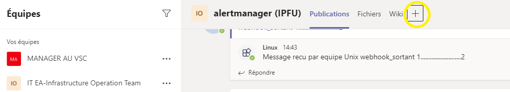
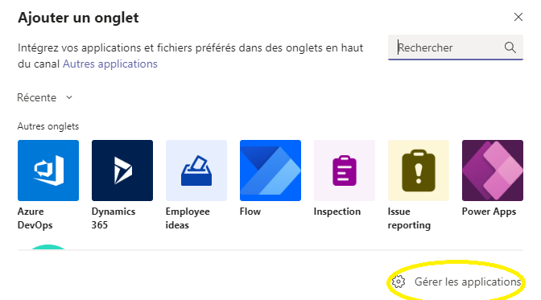
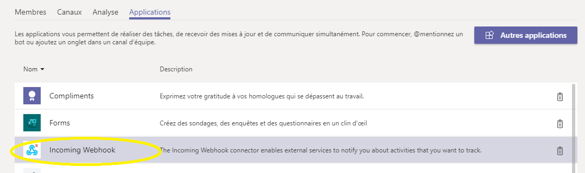
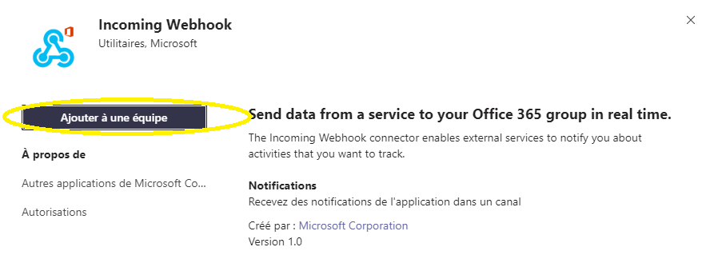
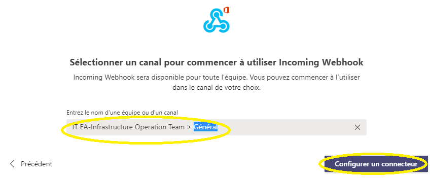
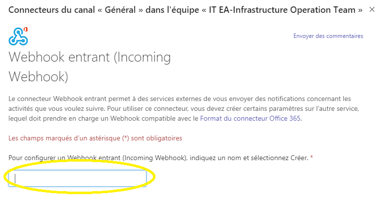
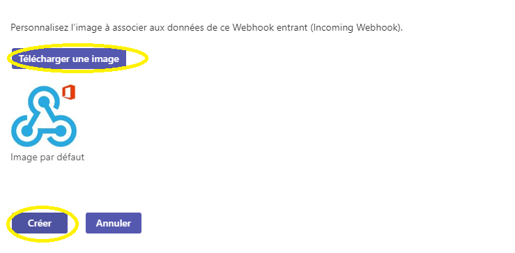

# Création d'un webhook entrant dans ms teams

La documentation permet de créer un webhook entrant dans ms teams, ainsi une application pourra envoyer des messages dans un channel teams

Lancer le client msteams   
Ensuite aller dans le channel où il faut créer le webhook   
Appuyer sur le bouton "+" pour lancer le menu suivant   

  

Cliquer sur "Gérer les applications"

   

Choisir "Incoming webhook"  

  

Cliquer sur "Ajouter à une equipe"   

  

Choisir le nom de l'equipe dans le champ prévu puis cliquer sur "Configurer un connecteur"   

   

Le champ indiqué "un nom" sera le nom de l'emetteur des messages quand on executera l'application   

   

Choisir une image, puis cliquer sur "Créer" 

  

Sauvegarder le lien fournit car il sera utilisé pour faire des tests du webhook   

   

 ## Test simple 
 
 on peut realiser un test avec une commande curl
 
 
fichier message.json
```
{
    "@type": "MessageCard",
    "@context": "http://schema.org/extensions",
    "themeColor": "0076D7",
    "summary": "Alertmanager closed a task",
    "sections": [{
        "activityTitle": "Alertmanager closed a task",
        "activitySubtitle": "System Up",
        "activityImage": "",
        "facts": [{
            "name": "Nom serveur",
            "value": "ctsr1347"
        }, {
            "name": "Alerte",
            "value": "ping OK"
        }],
        "markdown": true
    }]
}
```

On realise un test en remplacant les XXX par le lien obtenu dans l'etape précedente   

```
curl -X POST -d @message.json "https://outlook.office.com/webhook/XXXXXXXXXXXXXXXXXXXXXXXXXXXXXXXXXXXXXXXXXXXXXXXXXXXXX"
```


